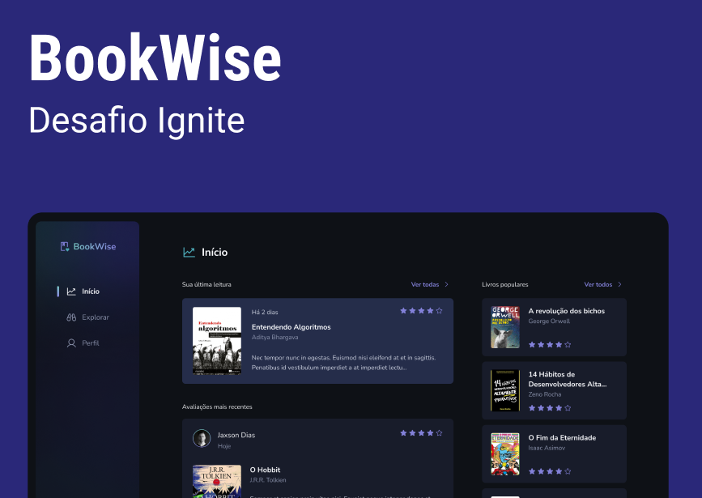

<h1 align="center">
  📘 Book Wise 📘
</h1>

<h4 align="center">
  O Book Wise é um site simples e intuitivo para distribuir livros de diversos gêneros. A proposta do site é mostrar os livros e permitir que os usuários se cadastrem para possibilitar avaliações para os livros. Além de avaliar os livros, o usuário também contara com um perfil personalizado contendo seus livros recentemente avaliados e uma análise sobre as últimas avaliações. Este site é um desafio proposto para todos os alunos do último módulo do boot camp da Rocketseat sobre React.
</h4>

  É interessante comentar que o Book Wise é uma aplicação full-stack do tipo BFF. A base do código é feito em Next junto com Prisma, possibilitando fazer chamadas ao banco de dados com o Api Routes.

  
  
  
  
  

 

  

